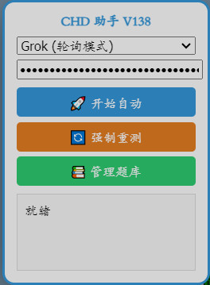
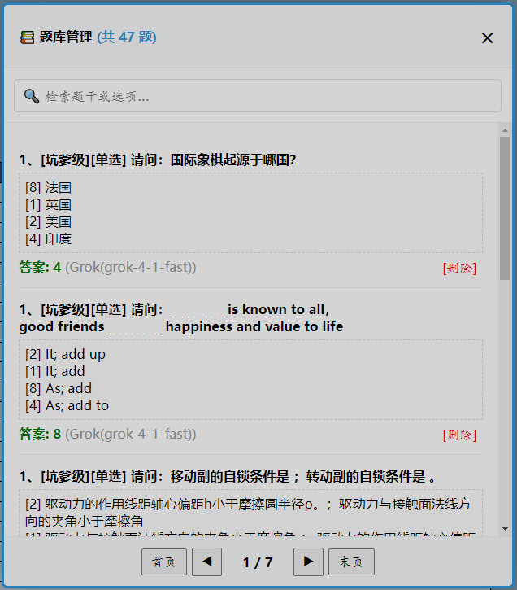

# CHDBits 签到助手 (Attendance Helper) - V138

## 📖 项目简介 (Introduction)

本项目是一款专为 CHDBits 设计的油猴脚本（Tampermonkey Script）。通过集成多种大模型（LLM）API，脚本能够智能研判签到题目，并具备强大的本地题库管理功能。

This is a Tampermonkey script designed for CHDBits. It leverages multiple LLM APIs to intelligently solve attendance quizzes and manage a local database.

---

## ✨ 核心特性 (Core Features)

- **🚀 多引擎支持 (Multi-Engine):** 支持 Grok (轮询模式), Kimi, GPT-4o-mini, Gemini 1.5 Flash。
- **🛡️ 双重指纹算法 (Advanced Fingerprinting):** 采用 V138 增强型双重哈希算法，彻底杜绝 ID 碰撞，确保题目识别精度。
- **📚 本地智库 (Local Intelligence):** 100% 优先命中本地题库，大幅节省 API 额度。
- **🔄 静默迁移 (Silent Migration):** 自动兼容并迁移旧版本（V55/V89）数据。
- **🛠️ 题库管理 (DB Management):** 内置可视化 UI，支持检索、分页管理及手动纠错。

---

## 🚀 安装指南 (Installation)

1.  **安装扩展:** 首先确保浏览器已安装 [Tampermonkey](https://www.tampermonkey.net/)。
2.  **获取脚本:** 点击本项目中的 `CHDBits_Attendance_Helper.user.js`。
3.  **点击安装:** 在弹出页面点击“安装”按钮。

---

## ⚙️ 使用说明 (Instructions)

1.  **配置 API:**
    - 脚本安装后，在签到页面左侧会出现控制面板。
    - 选择你拥有的 API 类型（推荐使用 Grok 或 Gemini，响应极快）。
    - 填写对应的 **API Key**。
2.  **开始运行:** - 点击 **“🚀 开始自动”**。脚本将优先检索本地数据库，若无匹配项则通过 AI 获取答案。
3.  **管理数据:**
    - 点击 **“📚 管理题库”** 可查看已保存的题目与答案，支持手动删除错误记录。

---

## 💡 开发者说明 (Developer Notes)

本脚本仅供学习交流使用。脚本核心逻辑实现了：
- **Zero-Footprint:** 除非必要，否则不请求外部 API。
- **Fault Tolerance:** 自动清理错误缓存，支持多模型接力尝试（Relay Mode）。

## 📄 开源协议 (License)

基于 [MIT License](LICENSE) 开源。
